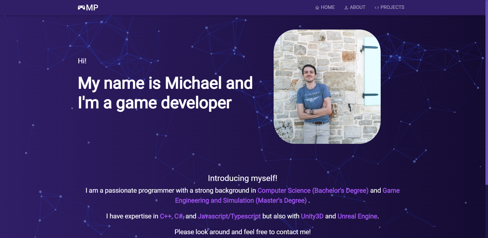

# Portfolio Website Template     

[DEMO](https://michaelprommer.com/)

---

---
## Overview

This is a website template built with React, Typescript, and React Bootstrap. It features a homepage, a React Router navigation bar, a footer, a responsive design and much more. The purpose of this template is to provide a starting point for developers who want to create a portfolio website to showcase their projects.

Design Inspiration taken from [Soumyajit4419](https://github.com/soumyajit4419/Portfolio)

Please give proper credit by linking back to [this repository](https://github.com/Prommerbua/Website) or my [GitHub profile](https://github.com/Prommerbua).

## Technologies used

This website template was built with the following technologies:

- React
- Typescript
- React Bootstrap
- React Router
- React Particle JS
- Photoswipe
- React Photoswipe Gallery

## Usage

To use this website template, follow these steps:

1. Clone this repository to your local machine using `git clone https://github.com/Prommerbua/Portfolio-Website.git`
2. Install the necessary dependencies by running `yarn install` in the terminal
3. Start the project locally by running `yarn start` in the terminal

After completing these steps, you will have a working version of the website running locally on your machine. From there, you can customize the website to your liking by adding your own content, modifying the styling, and adding new features as needed.

## Customization

This website template is highly customizable, and there are many ways you can modify it to suit your needs. Here are a few ideas to get you started:

- Customize the styling of the website by modifying the SCSS files
- Change the color scheme of the website to match your personal branding
- Modify the content of the homepage and portfolio section to showcase your own projects and experience

## Contributions

If you find a bug or have a suggestion for how to improve this website template, feel free to open an issue.

## License

This website template is licensed under the MIT License. For more information, see the LICENSE file in this repository.
